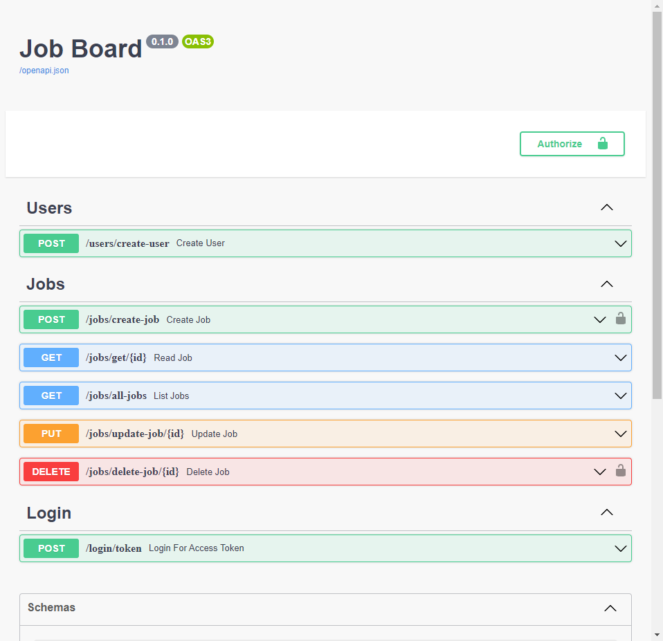

# Job board application

[](LICENSE)
[](https://github.com/xychen35)

## Features

- [FastAPI](https://fastapi.tiangolo.com/) framework
- Interactive API documentation
- Full Docker integration
- Docker Compose integration
- Production ready Python web server using Uvicorn
- Secure password hashing by default
- JWT token authentication
- SQLAlchemy models

## Requirements

- Docker
- docker-compose

## Quick Start

### Run Fastapi Docker (Local Development)

1. `git clone https://github.com/xychen35/job-board-app.git`
2. Create .env files `cp .env.tpl .env`

> You should now have a directory structure like:

```sh
/
├── backend/
│   ├── apis/
│   │   ├── base.py
│   │   ├── utils.py
│   │   └── version1/
│   │       ├── route_jobs.py
│   │       ├── route_login.py
│   │       └── route_users.py
│   ├── core/
│   │   ├── config.py
│   │   ├── hashing.py
│   │   └── security.py
│   ├── db/
│   │   ├── base.py
│   │   ├── base_class.py
│   │   ├── models/
│   │   │   ├── jobs.py
│   │   │   └── users.py
│   │   ├── repository/
│   │   │   ├── jobs.py
│   │   │   ├── login.py
│   │   │   └── users.py
│   │   └── session.py
│   ├── main.py
│   ├── requirements.txt
│   ├── schemas/
│   │   ├── jobs.py
│   │   └── users.py
│   ├── static/
│   │   └── images/
│   │       └── logo.png
│   ├── templates/
│   │   ├── auth/
│   │   │   └── login.html
│   │   ├── base/
│   │   │   └── base.html
│   │   ├── components/
│   │   │   ├── alerts.html
│   │   │   ├── card.html
│   │   │   └── navbar.html
│   │   ├── home/
│   │   │   └── homepage.html
│   │   ├── jobs/
│   │   │   ├── create_job.html
│   │   │   ├── detail.html
│   │   │   └── show_jobs_to_delete.html
│   │   └── users/
│   │       └── register.html
│   ├── tests/
│   │   ├── conftest.py
│   │   ├── test_routes/
│   │   │   ├── test_jobs.py
│   │   │   └── test_users.py
│   │   └── utils/
│   │       └── users.py
│   └── webapps/
│       ├── auth/
│       │   ├── forms.py
│       │   └── route_login.py
│       ├── base.py
│       ├── jobs/
│       │   ├── forms.py
│       │   └── route_jobs.py
│       └── users/
│           ├── forms.py
│           └── route_users.py
├── docker-compose.yml
├── Dockerfile
├── README.MD
```

3.`docker-compose up --build`
4.That's all, api server is listen at http://0:0:0:0:8000/docs now.

You will see the automatic interactive API documentation (provided by Swagger UI):

